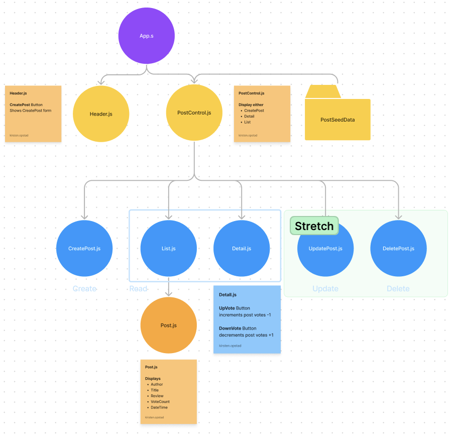

# ReadIt

#### By Kirsten Opstad & Aitana Shough

#### A Redux Vote-Based Discussion Forum

## Technologies Used

* React
* JavaScript
* Bootstrap
* HTML
* CSS
* webpack
* Node.js

## Description

__Prompt__

Sites like Reddit, HackerNews and others offer a collection of different pages or forums where users may post news, pictures, and other information around a certain topic. Other users can then upvote or downvote content. The more upvotes an item receives, the higher it's displayed on the list. Recreate a basic subreddit and/or vote-based discussion board using React and Redux. Here are some user stories to get you started:

### Objectives (MVP)
__User Stories:__
* As a user, I want to enter content into a form and submit to create a new post.
* As a user, I want my new posts to include a timestamp. And I want to see when other listings were posted, too.
* As a user, I want to upvote posts I particularly enjoy.
* As a user, I want to downvote posts I don't like, or find inappropriate.
* As a user, I'd like posts with the most upvotes to appear higher on the page. 

### Further Exploration (Stretch Goals)

__User stories:__
* As a user, I want the option to edit a coffee sack's properties after entering them just in case I make a mistake.
* As a user, I want to be able to delete a coffee sack.
* As a user, I want a coffee sack to update to say "Out of Stock" once it's empty.
* As a user, I want coffee sacks with less than 10 pounds to include a message that says "Almost Empty" so I can buy a pound of it before it's gone!
* As a user, I want to have coffee prices to be color-coded for easy readability. This could be based on their price, their origin or roast, or the amount of pounds left.
* As a user, I want this application to be nicely styled. (Use stylesheets and CSS objects!)

__Further Exploration__
* As a user, I want to click a post to view additional details. For now simply hide/show some message content. (Hint: You could create a currentlySelectedPost Redux state key, and alter the value based on which post the user is selecting.)

## Process 
1. Create component drawing 
[](https://www.figma.com/file/60mpb3MWZ7DSwzSeSoDFza/ReadIt?node-id=0%3A1&t=UREQKKZbX4YaWUe9-0)
2. Establish Component Hierarchy:
    * App.js
      * Header.js -> recieves user input with Create Post button
      * PostControl.js - displays either list, detail or create
        * List.js – displays all posts 
          * Post.js – displays Author, Title, Review, VoteCount -> recieves user input & in up / down vote click
        * Detail.js – displays details for single post
        * CreatePost.js – form to add new post
        <!-- Strech Components -->
        <!-- * Edit.js – form to edit item in inventory -->
3. Build Static Components
4. Add State
  * Local State to display either list, detail or add
  * Shared State to allow Create & Upvote / DownVote Functionality
5. Style to match 

<!-- [x] Screenshots

 -->

<!-- [Link to operational site](http://www.kirstenopstad.github.com/<REPOSITORY NAME>) -->

### Goals
1. Meet MVP
2. Add styling to match inspiration 
3. Stretch: Add Delete Post functionality

## Setup/Installation Requirements

* Clone this repo to your workspace.
* Navigate to the top level of the directory.
* In the root directory of the project, run this command to install all packages listed in the package.json:
```
$ npm install
```
* Then, to build and serve the project, run: 
```
$ npm run start
```

## Known Bugs

* No known bugs. If you find one, please email me at kirsten.opstad@gmail.com with the subject **[_Repo Name_] Bug** and include:
  * BUG: _A brief description of the bug_
  * FIX: _Suggestion for solution (if you have one!)_
  * If you'd like to be credited, please also include your **_github user profile link_**

## License

MIT License

Copyright (c) 2023 Kirsten Opstad & Aitana Shough

Permission is hereby granted, free of charge, to any person obtaining a copy of this software and associated documentation files (the "Software"), to deal in the Software without restriction, including without limitation the rights to use, copy, modify, merge, publish, distribute, sublicense, and/or sell copies of the Software, and to permit persons to whom the Software is furnished to do so, subject to the following conditions:

The above copyright notice and this permission notice shall be included in all copies or substantial portions of the Software.

THE SOFTWARE IS PROVIDED "AS IS", WITHOUT WARRANTY OF ANY KIND, EXPRESS OR IMPLIED, INCLUDING BUT NOT LIMITED TO THE WARRANTIES OF MERCHANTABILITY, FITNESS FOR A PARTICULAR PURPOSE AND NONINFRINGEMENT. IN NO EVENT SHALL THE AUTHORS OR COPYRIGHT HOLDERS BE LIABLE FOR ANY CLAIM, DAMAGES OR OTHER LIABILITY, WHETHER IN AN ACTION OF CONTRACT, TORT OR OTHERWISE, ARISING FROM, OUT OF OR IN CONNECTION WITH THE SOFTWARE OR THE USE OR OTHER DEALINGS IN THE SOFTWARE.
